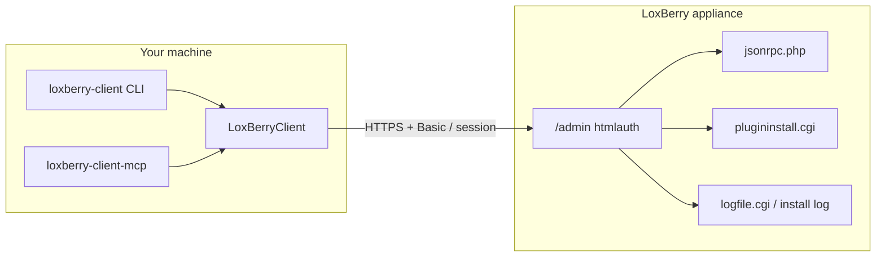

# loxberry-client-library

[](https://github.com/spid3r/loxberry-client-library/actions/workflows/ci.yml)
[](https://github.com/spid3r/loxberry-client-library/actions/workflows/release.yml)
[](https://www.npmjs.com/package/loxberry-client-library)
[](LICENSE)
[](https://www.conventionalcommits.org/)
[](https://github.com/semantic-release/semantic-release)
[](https://en.wikipedia.org/wiki/Beerware)

Releases to npm and the changelog are driven by **[semantic-release](https://github.com/semantic-release/semantic-release)** on `main` using **[Conventional Commits](https://www.conventionalcommits.org/)** — see [RELEASING.md](RELEASING.md) and [CONTRIBUTING.md](CONTRIBUTING.md). **Beerware** is an informal thank-you on top of MIT ([below](#license)).

### Monorepo

This repository is an **npm workspaces** monorepo: the root package **`loxberry-client-library`** (library + CLI) and **`packages/loxberry-client-mcp`** (**`loxberry-client-mcp`** on npm — MCP server). Each package has its own `package.json`, version line, and release notes; CI and Release workflows run from the repo root. See [RELEASING.md](RELEASING.md) for how the two packages are published.

TypeScript client for **LoxBerry 3.x** (3.x-first): JSON-RPC (`/admin/system/jsonrpc.php`), **HTTP Basic** on `/admin` (same as [stock `htmlauth/.htaccess`](https://github.com/mschlenstedt/Loxberry/blob/master/webfrontend/htmlauth/.htaccess)), and helpers aligned with **`plugininstall.cgi`** (plugin list, upload with SecurePIN, uninstall). Includes a small CLI and an optional MCP server package.

- [LoxBerry wiki — Node.js & JsonRpc](https://wiki.loxberry.de/entwickler/advanced_developers/nodejs_for_plugins)
- [Forum — JSON-RPC & MQTT](https://www.loxforum.com/forum/projektforen/loxberry/entwickler/330178-app-development-and-access-to-loxberry-using-json-rpc-and-or-webservices)

## Table of contents

- [Ways to use this project](#ways-to-use-this-project)
- [Install](#install)
- [Quick usage](#quick-usage)
- [Architecture (overview)](#architecture-overview)
- [CLI](#cli)
- [Environment file](#environment-file)
- [Browser and global builds](#browser-and-global-builds)
- [Plugin admin (stock LoxBerry)](#plugin-admin-stock-loxberry)
- [Plugin admin paths](#plugin-admin-paths)
- [MCP server](#mcp-server)
- [Development](#development)
- [License](#license)
- [Funding](#funding)

## Ways to use this project

You can integrate with LoxBerry in three complementary ways — often **library + CLI** for plugin development, or **MCP** when you want an AI assistant to drive the same operations.

| How | npm package | What it is for |
|-----|-------------|----------------|
| **Client library** | [`loxberry-client-library`](https://www.npmjs.com/package/loxberry-client-library) | **Automate** JSON-RPC, plugin **list / upload / uninstall**, and install-log polling from **Node.js or TypeScript** — ideal for **tests**, **CI**, and **plugin tooling** (build a zip, upload, verify, tear down). |
| **CLI** | same package (binary `loxberry-client`) | **Shell-friendly** commands (`plugins list`, `plugins upload`, `plugins uninstall`, `jsonrpc call`, …) without writing code. |
| **MCP server** | [`loxberry-client-mcp`](https://www.npmjs.com/package/loxberry-client-mcp) | **Model Context Protocol** stdio server for editors such as **Cursor** / **VS Code** — exposes LoxBerry operations as **tools** for assistants. |

**Plugin development and testing:** the library matches stock **`plugininstall.cgi`** behavior (multipart upload with SecurePIN, uninstall confirm flow, temp install log polling). That lets you **repeat upload → install → uninstall** cycles from scripts or tests instead of only manual clicks — see [Development](#development) → live tests (`test:live:full`) for an end-to-end example.

### Install locally (in another project)

Add the core package as a **dependency** so versions are pinned in `package-lock.json`:

```bash
npm install loxberry-client-library
```

Use `npx loxberry-client …` from that project for CLI commands, or `import { … } from "loxberry-client-library"` in code ([Quick usage](#quick-usage)).

### CLI: `npx` vs local vs global

- **`npx loxberry-client`** (after a local `npm install loxberry-client-library`) — runs the CLI from your project’s `node_modules` without a global install. Good for CI and team repos.
- **Global CLI** — one install, `loxberry-client` on your `PATH` everywhere:

  ```bash
  npm install -g loxberry-client-library
  loxberry-client --help
  ```

  Use when you want the same commands in any directory without a `package.json`.

### MCP server install

The MCP package is **separate** on npm (same GitHub monorepo). Install it like any other tool:

```bash
npm install loxberry-client-mcp
```

```bash
npx loxberry-client-mcp
```

or, globally: `npm install -g loxberry-client-mcp` then `loxberry-client-mcp`. Configuration (env vars, IDE `mcp.json`) is covered in [MCP server](#mcp-server) and [packages/loxberry-client-mcp/README.md](packages/loxberry-client-mcp/README.md).

## Install

**Core library + CLI** (this repository’s main package):

```bash
npm install loxberry-client-library
```

**MCP server** (optional; separate package):

```bash
npm install loxberry-client-mcp
```

See [Ways to use this project](#ways-to-use-this-project) for when to use each and local vs global CLI.

## Quick usage

```typescript
import { LoxBerryClient, SessionAuth } from "loxberry-client-library";

const baseUrl = "https://loxberry.local";
const session = new SessionAuth();
// Default strategy "basic": same user/password as the browser admin (Apache Basic on /admin)
await session.login(baseUrl, "admin", "secret");

const client = new LoxBerryClient({ baseUrl, session });

const ms = await client.call("LBSystem::get_miniservers", []);
const plugins = await client.plugins.listInstalledPlugins();
```

### MQTT broker hints (optional, JSON-RPC only)

**`fetchMqttConnectionDetails`** is exported from **`loxberry-client-library/mqtt`**. It calls LoxBerry JSON-RPC (`mqtt_connectiondetails` with fallbacks) and returns host/port/user/pass hints. **This repo does not ship or depend on an MQTT client** — connect with whatever library you use (`mqtt`, WebSocket, etc.).

```typescript
import { fetchMqttConnectionDetails } from "loxberry-client-library/mqtt";

const hints = await fetchMqttConnectionDetails(client);
// e.g. build an URL from hints?.brokerhost, hints?.brokerport, …
```

## Architecture (overview)

Stock LoxBerry 3.x serves the admin UI and APIs under **`/admin`** behind **HTTP Basic** (Apache `htmlauth`). This library sends the same credentials on each request and talks to **`jsonrpc.php`**, **`plugininstall.cgi`**, and related endpoints.



After **`plugins upload`**, the stock UI polls a **temp** install log URL; the library exposes **`followPluginInstallTempLog()`** for the same behavior before **`waitForPluginFolder()`**.

## CLI

The CLI reads **`process.env` only** (no bundled `.env` loader). After build, or via `npx` once published, run `loxberry-client --help`.

To load a file locally, use Node **20.6+** [`--env-file`](https://nodejs.org/api/cli.html#--env-fileconfig), for example:

```bash
node --env-file=.env ./node_modules/loxberry-client-library/dist/cli.cjs plugins list
```

(or set `LOXBERRY_*` in your shell / CI secrets).

<!-- CLI_REFERENCE_START -->

Auto-generated from [`src/cli-reference.ts`](src/cli-reference.ts) — run `npm run docs:sync-cli` after changing commands.

### Global flags

| Flag | Description |
|------|-------------|
| `--help` / `-h` | Print help and exit. |
| `--baseUrl <url>` | LoxBerry base URL (overrides `LOXBERRY_BASE_URL`). |
| `--user <name>` | Admin user (overrides `LOXBERRY_USERNAME`). |
| `--password <secret>` | Password (overrides `LOXBERRY_PASSWORD`). |
| `--file <path>` | Used by **`plugins upload`** — path to `.zip`. |
| `--name <id>` | Used by **`plugins uninstall`** — plugin md5 or folder name. |
| `--follow` | Used by **`logs install`** — poll generic install log until completion. |
| `--params '<json>'` | Used by **`jsonrpc call`** — JSON-RPC params (default `[]`). |

### Commands

| Command | Description |
|---------|-------------|
| `loxberry-client plugins list` | Print installed plugins (JSON) from plugin admin list URL. |
| `loxberry-client plugins upload --file ./plugin.zip` | POST multipart upload to stock `plugininstall.cgi` (set `LOXBERRY_SECURE_PIN` for install).<br><small>Does not wait on tempfile install log; use the library API (`followPluginInstallTempLog`) for automation.</small> |
| `loxberry-client plugins uninstall --name <md5|folder>` | Two-step GET uninstall (confirm + `answer=1`), same as the web UI. |
| `loxberry-client logs install` | Read `getInstallLog()` (generic path; not the per-upload tempfile).<br><small>Add `--follow` to poll until a completion phrase appears.</small> |
| `loxberry-client jsonrpc call <method> [--params '[]']` | Call `/admin/system/jsonrpc.php` with session/Basic headers. |

### Environment

| Variable | Purpose |
|----------|---------|
| `LOXBERRY_BASE_URL` | e.g. `https://loxberry.local` |
| `LOXBERRY_USERNAME` / `LOXBERRY_PASSWORD` | Web admin; sent as HTTP Basic on `/admin` (stock) |
| `LOXBERRY_HTTP_BASIC_*` | Optional separate Basic layer (see `.env.example`) |
| `LOXBERRY_AUTH_STRATEGY` | `basic` (default) or `form` |
| `LOXBERRY_LOGIN_PATH` | Form-login path if `form` |
| `LOXBERRY_SECURE_PIN` | Required for plugin install via upload API / MCP |

### Examples

```bash
npx loxberry-client plugins list --baseUrl https://loxberry.local --user admin --password "$LOX_PASS"
npx loxberry-client plugins upload --file ./dist/myplugin.zip
npx loxberry-client plugins uninstall --name <md5-or-folder>
npx loxberry-client logs install --follow
npx loxberry-client jsonrpc call LBSystem::get_miniservers --params '[]'
```

<!-- CLI_REFERENCE_END -->

## Environment file

- **`.env.example`** — committed template; copy to **`.env`** and fill in values. **`.env`** is gitignored and is never committed.
- **`test/live/loxberry-live.test.ts`** loads **`.env` from the repo root** with a tiny test helper (no `dotenv` package) when you run `npm run test:live*`.
- Live runs are gated by **`LOXBERRY_LIVE_TESTS=1`**, which only the `test:live*` npm scripts set. Keeping `LOXBERRY_BASE_URL` in `.env` for the CLI will not make **`npm test`** call your LoxBerry.

### npm lifecycle scripts

[`.npmrc`](.npmrc) sets **`ignore-scripts=true`** so dependency **postinstall** (and similar) scripts do not run during `npm install`. This library has **no runtime npm dependencies** (only devDependencies for building and testing). To run install scripts once (e.g. debugging a native addon), use `npm install --ignore-scripts=false` or temporarily remove that line.

## Browser and global builds

- **ESM / CJS**: `dist/index.js` and `dist/index.cjs` (see `package.json` `exports`).
- **IIFE (global)**: `dist/loxberry-client.browser.global.js` exposes the default export as `window.LoxBerryClient` (namespace object).

Calling a real LoxBerry from the browser usually hits **CORS**; prefer Node for automation or proxy requests through your dev server.

## Plugin admin (stock LoxBerry)

Defaults match upstream: list/upload/uninstall go to [`/admin/system/plugininstall.cgi`](https://github.com/mschlenstedt/Loxberry/blob/master/webfrontend/htmlauth/system/plugininstall.cgi). Upload requires your **SecurePIN** (same as the web UI):

```typescript
await client.plugins.uploadPluginZip(buf, "plugin.zip", { securePin: "1234" });
// Install runs in the background on the appliance; poll until the plugin row exists:
await client.plugins.waitForPluginFolder("myplugin", { title: "My Plugin", timeoutMs: 120_000 });
```

Uninstall uses the same flow as the UI: GET `do=uninstall&pid=<md5>` then confirm with `answer=1`.

Override paths only if your image differs:

## Plugin admin paths

Override via `LoxBerryClient` options when needed:

```typescript
new LoxBerryClient({
  baseUrl,
  session,
  pluginPaths: {
    list: "/your/path/plugins.php",
    upload: "/your/path/upload.php",
    uninstall: "/your/path/uninstall.php",
    installLog: "/your/path/log.php",
  },
});
```

Capture real URLs from your browser devtools and add **fixtures** under `test/fixtures/` to lock behavior (TDD).

## MCP server

See [packages/loxberry-client-mcp/README.md](packages/loxberry-client-mcp/README.md). Build with `npm run build:all`.

### Testing the MCP server

1. **Build**: `npm run build:all` (or `npm run build:mcp` if the core library is already built).
2. **Automated smoke (CI + local)**: after a build (`npm run build:mcp` or `build:all`), from the repo root — MCP SDK client over stdio: **`tools/list`** plus **`tools/call`** → `plugins_list` against a **dead port** (expects failure, proves the tool path works without a real LoxBerry):
   ```bash
   npm run test:mcp
   ```
3. **Real LoxBerry**: set env (see below) and use Inspector or Cursor; or point the server at your unit and invoke tools there.
4. **Env** (when actually calling tools): set `LOXBERRY_BASE_URL` (and credentials) for the server process — same variables as [`.env.example`](.env.example).
5. **Manual / IDE**: [`@modelcontextprotocol/inspector`](https://www.npmjs.com/package/@modelcontextprotocol/inspector):
   ```bash
   npx @modelcontextprotocol/inspector node packages/loxberry-client-mcp/dist/server.js
   ```
6. **Cursor / Copilot**: use a **stdio** server; pass **`LOXBERRY_*` in `env`** in `mcp.json` (Cursor does not load your `.env` for MCP). Examples: local `node` + path to `dist/server.js`, or after **`npm i -g loxberry-client-mcp`** use **`command`: `loxberry-client-mcp`** (see [packages/loxberry-client-mcp/README.md](packages/loxberry-client-mcp/README.md)).

Publishing **`loxberry-client-mcp`** as its own npm package (alongside **`loxberry-client-library`**) is described in [RELEASING.md](RELEASING.md).

## Development

```bash
npm install
cp .env.example .env   # then edit; PowerShell: Copy-Item .env.example .env
npm test
npm run build
```

For maintainers: [AGENTS.md](AGENTS.md) summarizes architecture and conventions for AI-assisted work. Conventional commits and devDependency rationale: [CONTRIBUTING.md](CONTRIBUTING.md). Releases and npm: [RELEASING.md](RELEASING.md).

**Before the first push to `main` (or merge that lands on `main`):** run the full local gate and `npm run release:dry-run` so CI and semantic-release match your expectations—see the **First push checklist** in [RELEASING.md](RELEASING.md).

### Live tests (real LoxBerry)

Default **`npm test`** never registers the live suite (no appliance required). The **`test:live*`** scripts set **`LOXBERRY_LIVE_TESTS=1`** so Mocha runs [`test/live/loxberry-live.test.ts`](test/live/loxberry-live.test.ts) against your unit.

| Script | What it does |
|--------|----------------|
| `npm run test:live` | Read-only style checks: login, JSON-RPC `LBSystem::get_miniservers`, `listInstalledPlugins`. |
| `npm run test:live:upload` | Same + **uploads** the tiny fixture under [`test/fixtures/e2e-plugin/`](test/fixtures/e2e-plugin/) (zipped in memory). Installs plugin folder **`loxberryclie2e`**. |
| `npm run test:live:full` | Same as upload, then **uninstalls** that plugin — only if title matches **`E2E Client Lib`** (safety check). **Use only on a dev LoxBerry you control.** Verifies **list → upload/install → list → uninstall → list**. |
| `npm run test:live:debug` | Same as **`test:live:upload`**, plus **`LOXBERRY_LIVE_DEBUG=1`**: writes **`tmp/loxberry-live-debug/`** (`upload-response.html`, **`list-latest.html`**, **`trace.log`**) and stderr traces. Upload only (no uninstall). |
| `npm run test:live:debug:full` | **`test:live:full`** + **`LOXBERRY_LIVE_DEBUG=1`**: full install **and** uninstall cycle with the same debug artifacts, plus **`uninstall-response.html`** after confirm. Best single command to prove list/upload/uninstall end-to-end. |

#### How long should upload + install take?

- **HTTP POST** (upload zip): usually **1–15 seconds** to the Pi.
- **Background `plugininstall.pl`** for the tiny E2E plugin: often **~20–90 seconds** on a normal SD card; under load, updates, or slow I/O it can reach **2–4 minutes**. The test polls the plugin list until **`LOXBERRY_LIVE_INSTALL_TIMEOUT_MS`** (default **120000** = 2 minutes) or Mocha’s slow-suite timeout (**install wait + 60s** headroom, max 10 minutes). If installs routinely exceed 2 minutes, raise **`LOXBERRY_LIVE_INSTALL_TIMEOUT_MS`** (e.g. `300000`).

The **`listInstalledPlugins`** live test is quick (~1s) and **fails fast** if the HTML parser finds zero plugins (misconfigured base URL or non-stock markup). The **upload / uninstall** tests live in a nested **`describe`** with a long Mocha timeout so only that block waits for `plugininstall.pl` on the Pi.

#### Debugging (logs + artifacts)

1. Run **`npm run test:live:debug`** (upload + artifacts) or **`npm run test:live:debug:full`** (adds uninstall + **`uninstall-response.html`**). Open **`tmp/loxberry-live-debug/upload-response.html`** — if it is not the install log viewer, the POST did not start an install (PIN, lock, validation).
2. Open **`list-latest.html`** — raw last plugin list GET body; after **`debug:full`**, refresh mentally: row should appear after install, disappear after uninstall.
3. Open **`uninstall-response.html`** ( **`debug:full`** only ) — HTML from the confirmed uninstall GET.
4. Read **`trace.log`** (and stderr): install log polls, list polls, uninstall steps.
5. For any app using **`LoxBerryClient`** (CLI, scripts), set **`LOXBERRY_CLIENT_DEBUG=1`** to print the same plugin-step lines to stderr without writing files.

**Upload POST** matches the stock browser form: `saveformdata`, empty **`archiveurl`**, **`uploadfile`** as `application/zip`, **`securepin`**, **`btnsubmit`**. The client checks that the response looks like the install **log progress** page (not an error/lock HTML).

After upload, the stock UI polls **`logfile.cgi?logfile=<random>.log`** until `plugininstall.pl` finishes. The library does the same via **`followPluginInstallTempLog()`** (tempfile from **`extractInstallLogTempfileFromHtml()`** on the POST body) **before** waiting for the new plugin row — polling only the plugin list is not enough.

#### Manual install check (same zip as the live test)

Stock [`plugininstall.pl`](https://github.com/mschlenstedt/Loxberry/blob/master/sbin/plugininstall.pl) **always** runs `cp …/icons/*`. A zip **without** `icons/icon_64.png` (and siblings) makes that step fail; the plugin may never show in the UI. The fixture now includes minimal PNGs.

Build a zip on disk and upload it in the browser (Plugin management → Install):

```bash
npm run build:e2e-zip
```

Default output: **`tmp/loxberryclie2e-manual-upload.zip`** (override: `npx tsx scripts/build-e2e-plugin-zip.ts path/to/out.zip`). If that works in the UI but the automated test does not, compare SecurePIN and credentials; if the zip fails in the UI too, open the installation log on the LoxBerry page.

You can put **`LOXBERRY_LIVE_UPLOAD`** / **`LOXBERRY_LIVE_UNINSTALL`** in `.env` if you like; **`LOXBERRY_LIVE_TESTS`** should come only from the npm scripts. Uninstall is gated by **`LOXBERRY_LIVE_UNINSTALL=1`** (`test:live:full` sets it).

**Upload tests** need **`LOXBERRY_SECURE_PIN`** in `.env` (the same SecurePIN you enter on the plugin install page in the browser). Without it, `test:live:upload` / `test:live:full` fails with a clear error.

If your LoxBerry uses different plugin admin URLs than the library defaults, live tests will fail until you align **`pluginPaths`** (extend the live test client options if needed).

### Auth: `basic` vs `form`

Stock LoxBerry does **not** use `/admin/index.php` for login — the whole `htmlauth` tree is **`AuthType Basic`** ([`.htaccess`](https://raw.githubusercontent.com/mschlenstedt/Loxberry/master/webfrontend/htmlauth/.htaccess)). The client default **`strategy: "basic"`** sends `Authorization: Basic …` with your web UI user/password on every request (and probes `/admin/system/index.cgi`).

If you use a **custom HTML form** login instead, set **`LOXBERRY_AUTH_STRATEGY=form`** and **`LOXBERRY_LOGIN_PATH`** as needed.

### Troubleshooting

- **401**: Wrong username/password for **HTTP Basic** (same as first browser prompt on `/admin`).
- **404 on “login”**: You were on the old form-login path; with defaults, auth probes **`/admin/system/index.cgi`**. Fix **`LOXBERRY_BASE_URL`** (scheme/host/port).
- **JSON-RPC** uses the same `Authorization` (and cookies, if any) as other `/admin` requests — nothing extra to enable ([wiki — JsonRpc](https://wiki.loxberry.de/entwickler/advanced_developers/nodejs_for_plugins)).
- Optional: **`LOXBERRY_HTTP_BASIC_*`** if the Basic user/password differ from **`LOXBERRY_USERNAME` / `LOXBERRY_PASSWORD`**.

## License

MIT — see [LICENSE](LICENSE).

**Beerware:** If we meet someday and you found this useful, you can buy me a beer. (This is a social request, not a legal condition of the MIT license.)

## Funding

`package.json` includes an npm [`funding`](https://docs.npmjs.com/cli/v10/configuring-npm/package-json#funding) field; run `npm fund` in this repo to see the URL.
